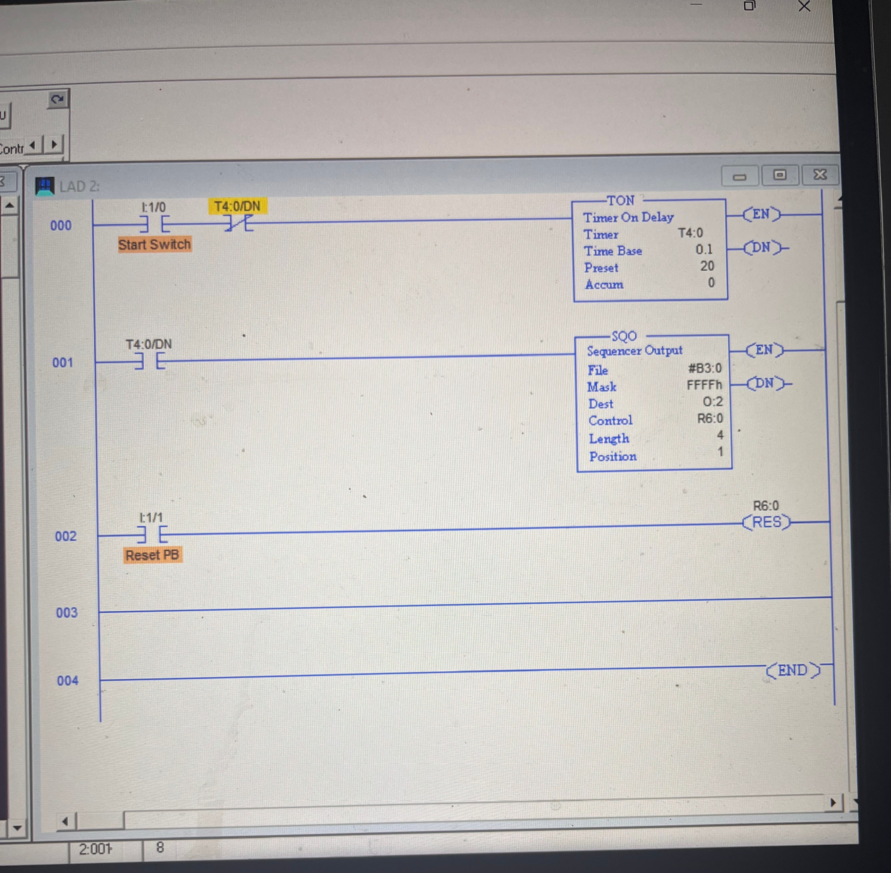
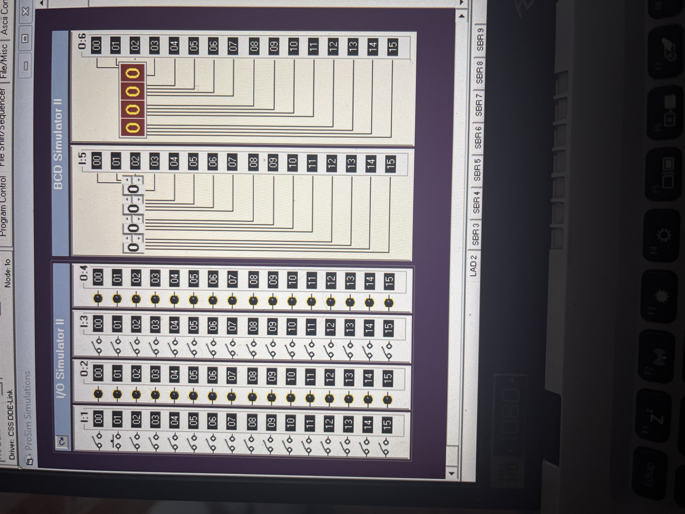
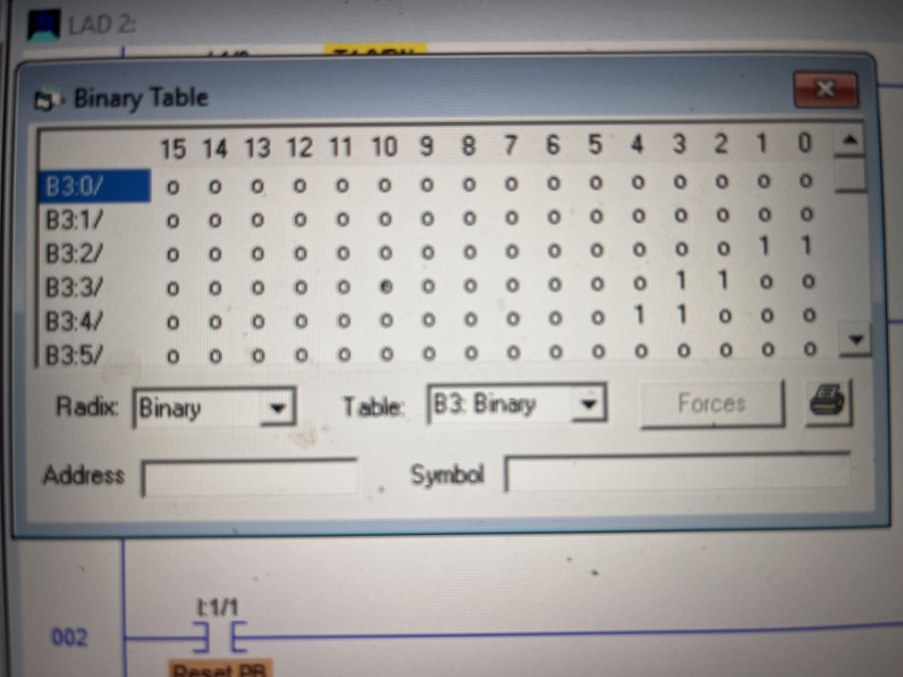

# 🚀 PLC SQO Motors & Pilot Lights Control

**Sequencer Output Instruction (SQO) Implementation**  
*Allen-Bradley LogixPro / RSLogix 500*

---

### 📋 Project Description

This project demonstrates the use of the **Sequencer Output (SQO)** instruction to control a multi-step industrial sequence:

- **Step 1**: All outputs OFF (rest position)
- **Step 2**: Motor 1 + Motor 2 ON
- **Step 3**: Green + Red Pilot Lights ON
- **Step 4**: Red + Yellow Pilot Lights ON

The sequence cycles continuously. Two operating modes are implemented:
1. **Manual Step Mode** (Push Button)
2. **Automatic Timed Mode** (TON Timer)

---

### 🛠 Tech Stack & Tools

- **Software**: LogixPro Simulator + RSLogix 500
- **PLC Platform**: Allen-Bradley MicroLogix / SLC 500 Simulator
- **Programming Language**: Ladder Logic (LAD)
- **Key Instruction**: `SQO` (Sequencer Output)
- **Control**: `R6:0`, File `B3:0`, Mask `FFFFh`

---

### 📂 Logic Architecture

| Component              | Rung | Description                                      | Key Elements                  |
|------------------------|------|--------------------------------------------------|-------------------------------|
| **Start Logic**        | 000  | Start Switch + Timer Done Bit                    | `I:1/0`, `T4:0/DN`           |
| **SQO Instruction**    | 001  | Main sequencer controlling outputs               | `B3:0`, `O:2`, `R6:0`, Len=4 |
| **Reset**              | 002  | Reset Push Button                                | `I:1/1` → `RES R6:0`         |
| **Timer (Auto Mode)**  | -    | Automatic step advancement                       | `T4:0` (Preset adjustable)   |

---

### 🔢 Sequence Steps (B3:0 File)

| Step | B3:0 Binary Value | Motors | Green | Red | Yellow | Description          |
|------|-------------------|--------|-------|-----|--------|----------------------|
| 0    | `00000`           | OFF    | OFF   | OFF | OFF    | All OFF (Rest)       |
| 1    | `00011`           | ON     | OFF   | OFF | OFF    | Motors 1 & 2         |
| 2    | `01100`           | OFF    | ON    | ON  | OFF    | Green + Red          |
| 3    | `11000`           | OFF    | OFF   | ON  | ON     | Red + Yellow         |

**Mask used**: `FFFFh` (passes all bits — safe for this application)

---

### 🎯 Features

- Clean SQO implementation with proper masking
- Both manual (push-button) and automatic (timer) modes
- Reset functionality at any point
- Detailed binary table setup documentation
- Professional ladder logic layout

---

### 📸 Visuals

---

### 📁 How to Use

1. Open **LogixPro**
2. Load the `.RSS` file from `Logic_Source/`
3. Go Online → Download
4. Toggle **I:1/0** (Start Switch) or enable the timer for auto mode
5. Use **I:1/1** to reset sequence

---

### 🎓 Academic Context

Part of advanced PLC programming training focusing on **Sequencer Instructions** (`SQO`), state machines, and industrial sequence control.

**Made with determination ❤️**

---

### Resources

- [LogixPro Official](https://www.logixpro.com)
- Allen-Bradley RSLogix 500 Documentation
